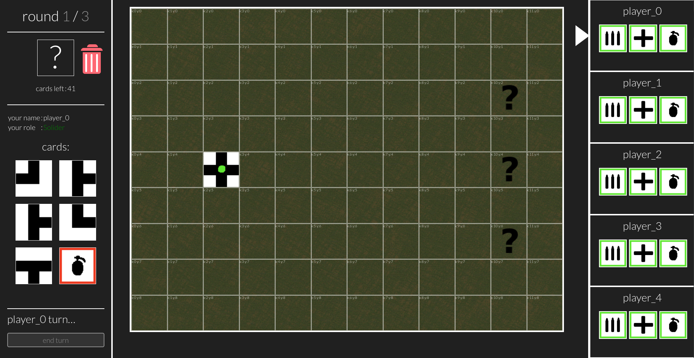

# TUNNEL GAME



### description:
The tunnel game is a copy of the saboteur card game.
I decided to write it in python to improve my skills in this language.
In the mechanics of this game you can find many interesting solutions to various problems such as:
- pathfinding to know if the tunnel is routed from start to finish without gaps
- rest api for communication between the game and the server
- validation of input data to prevent cheating
- game lobby so players can easily create new rooms and play with each other
- and many more...

### how to launch game server:

```commandline
python3 main.py
```

### how to launch tests:
```commandline
python3 tests.py
```

#### TODO:
* disable join button if room is full
* refresh rooms list each x second
* dealocate empty rooms from memory
* create stats page
* finish implementing gameplay

